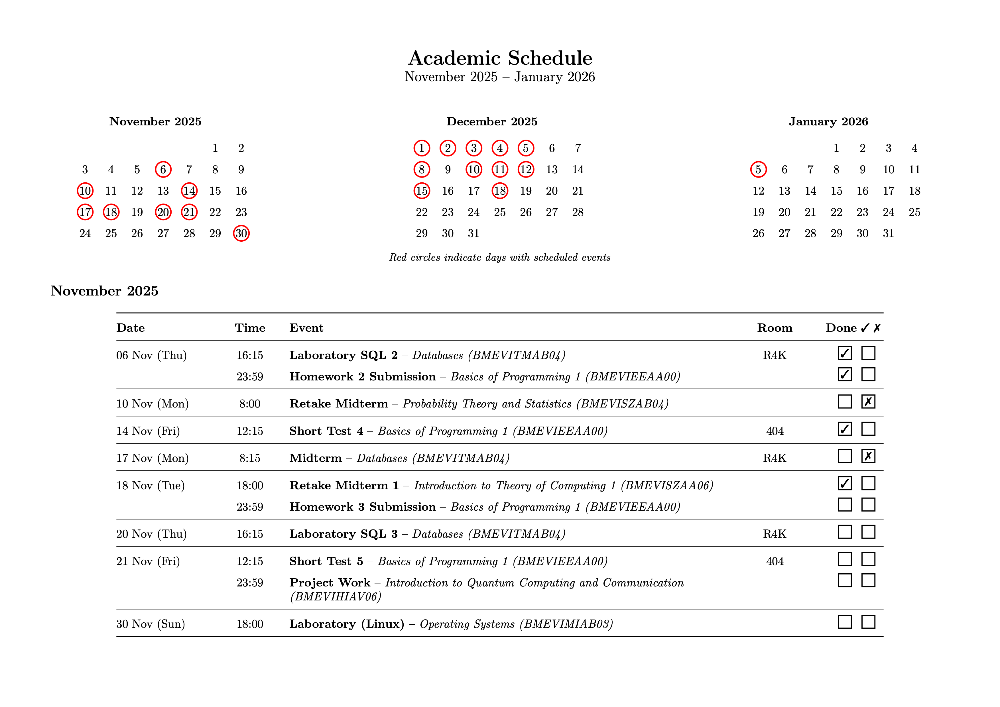

# Academic Schedule Generator

[](https://www.python.org/downloads/)
[](https://opensource.org/licenses/MIT)
[](https://github.com/psf/black)



## Overview

A Python-based tool that generates professional academic schedules in PDF format from JSON data. The generated PDF includes interactive checkboxes for tracking task completion, mini calendars with highlighted event days, and a clean table layout showing dates, times, events, and room assignments. Event types and course names are clearly formatted with course codes for easy reference.

## Features

- **Automated PDF Generation**: Converts JSON schedule data into formatted LaTeX and PDF documents
- **Interactive Checkboxes**: Click-to-check boxes for tracking completed tasks (checkmark for done, cross for not done)
- **Visual Calendar**: Mini calendars highlighting days with scheduled events
- **Professional Formatting**: Clean, landscape-oriented layout optimized for printing
- **Course Information**: Displays course codes, names, and room assignments
- **Flexible Event Types**: Supports exams, homework, labs, and custom event types

## Requirements

- Python 3.x
- LaTeX distribution (TeX Live, MiKTeX, or similar)
- pdflatex command-line tool

### LaTeX Packages Required

- hyperref
- pifont
- tikz (with calendar and shapes.geometric libraries)
- longtable
- array
- booktabs
- geometry

## Installation

1. Ensure Python 3.x is installed on your system
2. Install a LaTeX distribution if not already present
3. Clone or download this repository
4. No additional Python dependencies are required (uses standard library only)

## Usage

### Basic Usage

Run the script with default settings:

```bash
python3 generate_schedule.py
```

The script will:

1. Read `schedule_data.json`
2. Generate `Academic Schedule.tex`
3. Compile the PDF automatically
4. Create `Academic Schedule.pdf`

### Command-Line Options

Specify custom input and output files:

```bash
python3 generate_schedule.py <input_json> <output_tex>
```

Example:

```bash
python3 generate_schedule.py my_schedule.json my_schedule.tex
```

## JSON Data Structure

### Schedule Information

```json
{
  "schedule_info": {
    "title": "Academic Schedule",
    "period": "November 2025 -- January 2026",
    "start_date": "2025-11-01",
    "end_date": "2026-01-31"
  }
}
```

### Subject Definitions

```json
{
  "subjects": {
    "subject_key": {
      "name": "Subject Name",
      "code": "COURSE_CODE",
      "default_room": "Room Number"
    }
  }
}
```

### Event Entries

```json
{
  "events": [
    {
      "date": "2025-11-15",
      "time": "14:00",
      "subject": "subject_key",
      "type": "Midterm",
      "room": "Room 101",
      "section": "Exam Period"
    }
  ]
}
```

**Event Fields:**

- `date`: ISO format (YYYY-MM-DD) or "TBA" for to-be-announced
- `time`: 24-hour format (HH:MM) or empty string
- `subject`: Reference to subject key
- `type`: Event description (e.g., "Midterm", "Homework Submission")
- `room`: Optional, overrides default room
- `section`: Optional, use "Exam Period" for special section

## Output

The generated PDF includes:

1. **Title Section**: Schedule title and time period
2. **Calendar View**: Monthly calendars with highlighted event days
3. **Event Tables**: Organized by month with columns for Date, Time, Event (type and course), Room, and Done (interactive checkboxes)
4. **Exam Period Section**: Separate section for exam-related events

## Notes

PDF form features (interactive checkboxes) work best in Adobe Acrobat Reader or PDF Expert. macOS Preview has limited support for custom checkbox symbols. For best results, use a full-featured PDF viewer. The LaTeX compilation may take a few seconds depending on document size.

## Contributing

Contributions are welcome! Feel free to:

- Report bugs
- Suggest new features
- Submit pull requests
- Improve documentation

## License

This project is licensed under the MIT License - see the [LICENSE](LICENSE) file for details.

## Version

Current version: 1.0.0

## Acknowledgments

Built with Python and LaTeX for academic productivity.
